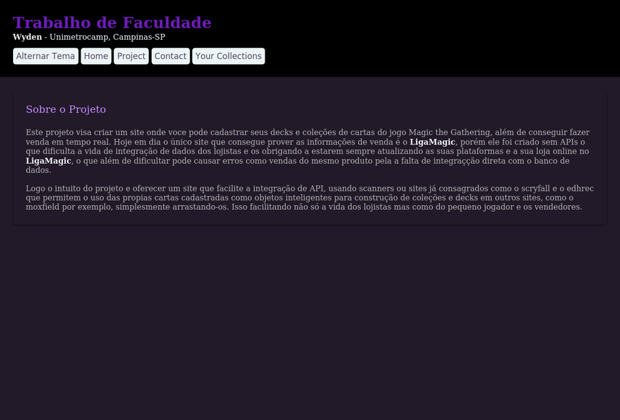
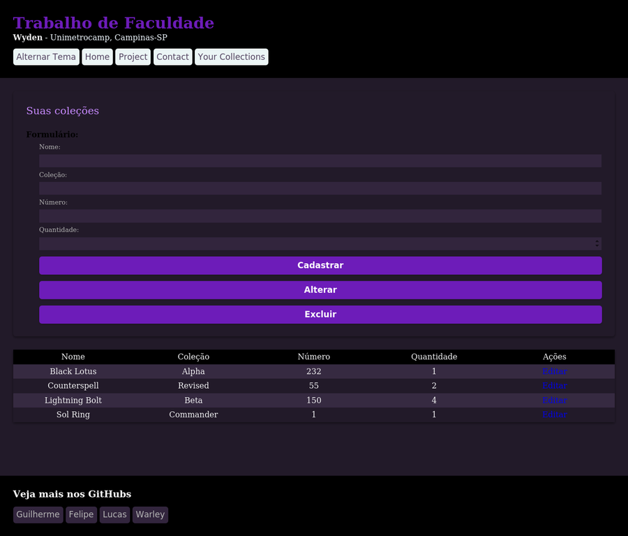
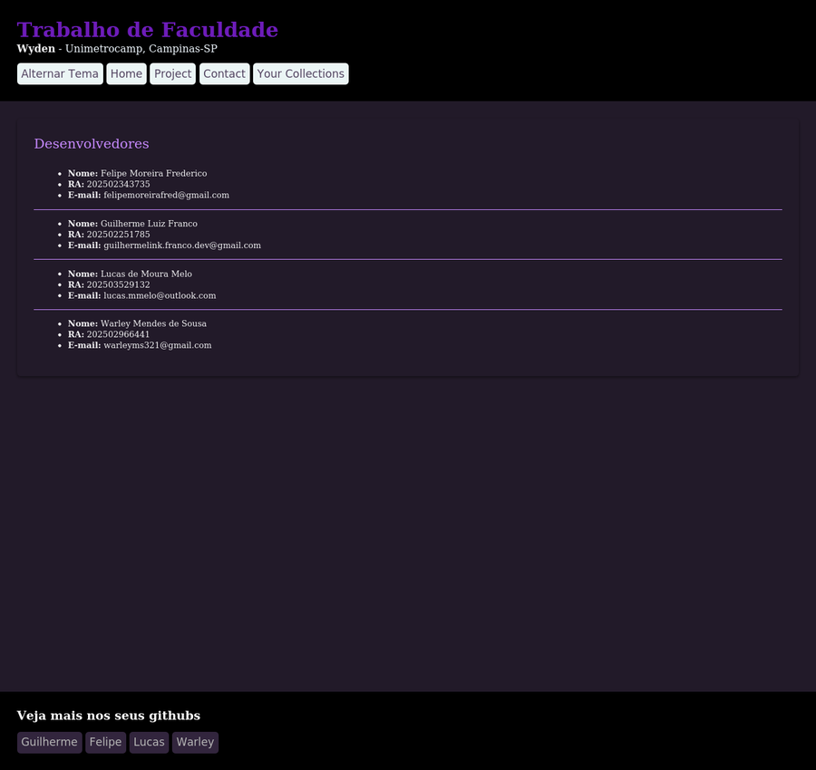
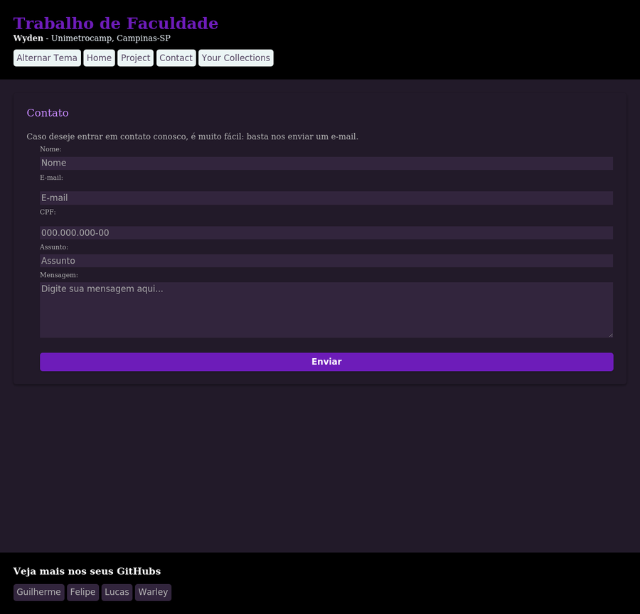

<div align="center">

# 🃏 Magic: The Gathering - Gerenciador de Coleções

Projeto acadêmico desenvolvido para a disciplina da **Wyden - Unimetrocamp**, Campinas-SP.

</div>

---

## 📖 Sobre o Projeto

Este projeto é um site onde o usuário pode **cadastrar, editar, listar e excluir cartas** de suas coleções e decks do jogo *Magic: The Gathering*.

A ideia por trás do projeto é resolver um problema real do mercado: hoje o principal site de referência para compra e venda de cartas no Brasil (LigaMagic) não possui uma API pública, o que dificulta a integração de dados entre lojistas e obriga atualizações manuais constantes em múltiplas plataformas — gerando riscos como vendas duplicadas por falta de sincronização entre o estoque físico e o digital.

A proposta deste projeto é servir como base para uma plataforma que facilite essa integração, permitindo futuramente conectar com APIs já consolidadas (como Scryfall e EDHREC) para tratar cada carta cadastrada como um objeto padronizado, reutilizável em outras ferramentas do ecossistema (como o Moxfield).

## ✨ Funcionalidades

- 📋 Cadastro de cartas (nome, coleção, número e quantidade)
- ✏️ Edição de cartas já cadastradas
- 🗑️ Exclusão de cartas da coleção
- 🎨 Alternância entre dois temas visuais (claro/escuro), salva no navegador
- 📄 Páginas institucionais: Home, Projeto e Contato

## 🛠️ Tecnologias Utilizadas

| Camada | Tecnologia |
|---|---|
| Back-end | PHP (com extensão `mysqli`) |
| Banco de Dados | MySQL / MariaDB |
| Front-end | HTML5, CSS3 |
| Interatividade | JavaScript (vanilla) |
| Assets | Imagens de cartas e ícones estáticos |

## 🗂️ Estrutura do Projeto

```
projeto_Magic-the-Gathering/
├── index.php              # Página inicial
├── collections_01.php     # Cadastro e listagem de cartas (conectado ao banco)
├── acao.php                # Processa cadastrar / editar / excluir (recebido via POST)
├── conexao.php             # Configuração de conexão com o MySQL
├── project_01.html         # Página "Sobre o Projeto"
├── contact_01.html         # Página de contato (com validação de CPF/e-mail)
├── inserir.php
├── css/                     # Folhas de estilo (dois temas)
├── js/                      # Scripts de alternância de tema e validação de formulário
├── php/                     # Scripts auxiliares
└── assets/
    ├── cards/               # Imagens de cartas
    └── icons/                # Ícones do site
```

## 🖥️ Telas do Sistema

### Página Inicial
Apresenta o projeto e links de navegação para as demais seções.



### Suas Coleções
Formulário de cadastro/edição de cartas e listagem das cartas já cadastradas, puxadas diretamente do banco de dados.



### Sobre o Projeto
Página com informações detalhadas sobre o propósito do sistema.



### Contato
Formulário de contato com validação de CPF e e-mail em tempo real.



## ⚙️ Como Rodar Localmente

1. Configure um ambiente com PHP e MySQL (ex: XAMPP, Laragon ou WAMP)
2. Crie um banco de dados chamado `collection` com a tabela `cards`:
   ```sql
   CREATE DATABASE collection;
   USE collection;
   CREATE TABLE cards (
       id INT AUTO_INCREMENT PRIMARY KEY,
       nome VARCHAR(255),
       colecao VARCHAR(255),
       numero VARCHAR(50),
       quantidade INT
   );
   ```
3. Ajuste as credenciais em `conexao.php` se necessário (usuário/senha do seu MySQL local)
4. Coloque a pasta do projeto no diretório servido pelo seu servidor local (ex: `htdocs`)
5. Acesse `http://localhost/projeto_Magic-the-Gathering/index.php`

## 👥 Autores

Projeto desenvolvido em grupo por **Guilherme**, **Felipe**, **Lucas** e **Warley**.

## ⚠️ Observações Técnicas

- O projeto ainda não inclui um script `.sql` de criação do banco no repositório — foi necessário inferir a estrutura da tabela a partir do código para testes.
- As consultas SQL em `acao.php` e `collections_01.php` usam os dados de `$_POST`/`$_GET` diretamente na query, sem *prepared statements*, o que deixa o sistema vulnerável a **SQL Injection**. Recomenda-se migrar para `mysqli::prepare()` antes de qualquer uso em produção.
